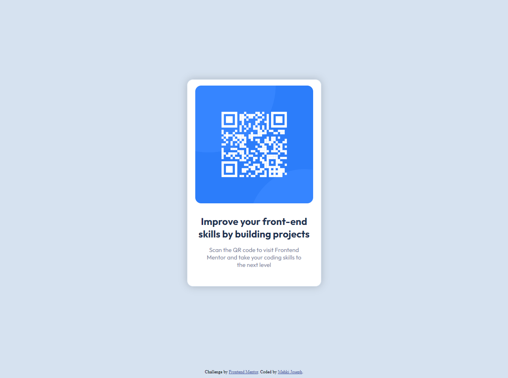

# Frontend Mentor - QR code component solution

This is a solution to the [QR code component challenge on Frontend Mentor](https://www.frontendmentor.io/challenges/qr-code-component-iux_sIO_H). Frontend Mentor challenges help you improve your coding skills by building realistic projects. 

## Table of contents

- [Overview](#overview)
  - [Screenshot](#screenshot)
  - [Links](#links)
- [My process](#my-process)
  - [Built with](#built-with)
  - [What I learned](#what-i-learned)
  - [Continued development](#continued-development)
- [Author](#author)

## Overview

### Screenshot



### Links

- Solution URL: [Add solution URL here](https://your-solution-url.com)
- Live Site URL: [Add live site URL here](https://your-live-site-url.com)

## My process

The entire project was created using ONLY flexbox for the layout.

I started off by adding the image and structuring my content in my HTML by wrapping them in container divs. I like to work in small increments, (sort of like solving smaller problems within the bigger picture problem) so I started by adding a bit of style to the container and the elements, and working my way up from what I had. I then imported the fonts from the style guide, and continued working up from there (I'll save you the rest of the boring details).

One thing that I did that I thought was quite clever was adding a border around the container that matches the color of the background. It's very subtle, but in conjunction with the box shadow surrounding the container, it make it seem as if there's this sort of blending effect between the container and the background. It's hard to describe in words, but if you go into the DOM in dev tools and disable the border, you'll get exactly what I mean lol.

### Built with

- Semantic HTML5 markup
- CSS custom properties
- Flexbox

### What I learned

I learned that I suck at flexbox. I'm currently going through The Odin Project's curriculum right now trying to teach myself web development, and I've gotten well past the CSS portion (and onto the beginner JS portion). I found myself struggling with flexbox during the course, and I continue to find myself in that predicament. Although it's a negative, it'll give me something to work towards improving as I continue to learn web development.

Here's some code that I'm proud of. As mentioned above, this is what I think made the design really shine in this exercise:

```css
.container {
  border: 1px solid hsl(212, 45%, 89%);
  box-shadow: 0 0 20px rgba(0, 0, 0, 0.2);
}
```

### Continued development

As mentioned previously, I hope to continue to strengthen my CSS fundamentals, starting by doing as many small CSS-related projects as I can. Flexbox is definitely going to be a big pain point for me, and I hope to improve my skills in that area as time goes on. I know grid has made its appearance and is gaining popularity among web devs, but I think flexbox will always have its uses, na dif I want to become a great web developer flexbox is a hurdle I am definitely going to have to cross.

## Author

- Website - [Mehki Joseph](https://github.com/mehkij)
